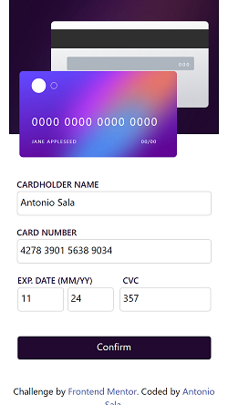

# Frontend Mentor - Interactive card details form

## Table of contents

- Overview
  - The challenge
  - Screenshot
  - Links
- My process
  - Built with
- Author

## Overview

### The challenge

Your users should be able to: 

- Fill in the form and see the card details update when submitted
- Receive error messages when the form is submitted if:
  - Any input field is empty
  - The card number, expiry date, or CVC fields are in the wrong format
- View the optimal layout depending on their device's screen size
- See hover, active, and focus states for interactive elements on the page

### Screenshot

### Links

- Solution URL: https://github.com/Antho137/interactive-card-details-form
- Live Site URL: https://antho137.github.io/interactive-card-details-form/

## My process

### Built with

- Semantic HTML5 markup
- CSS custom properties
- Flexbox
- Mobile-first workflow
- Bootstrap
- JavaScript

## Author

- Website - "https://antoniosala.online"
- Frontend Mentor - "https://www.frontendmentor.io/profile/Antho137"
- Twitter - "https://www.twitter.com/antoniosala73"